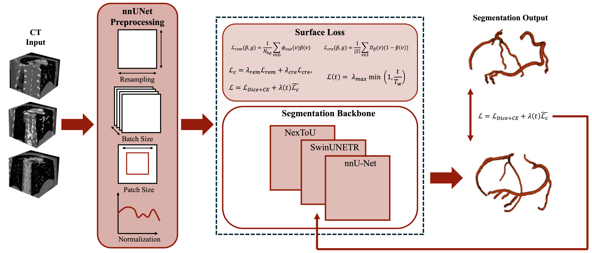
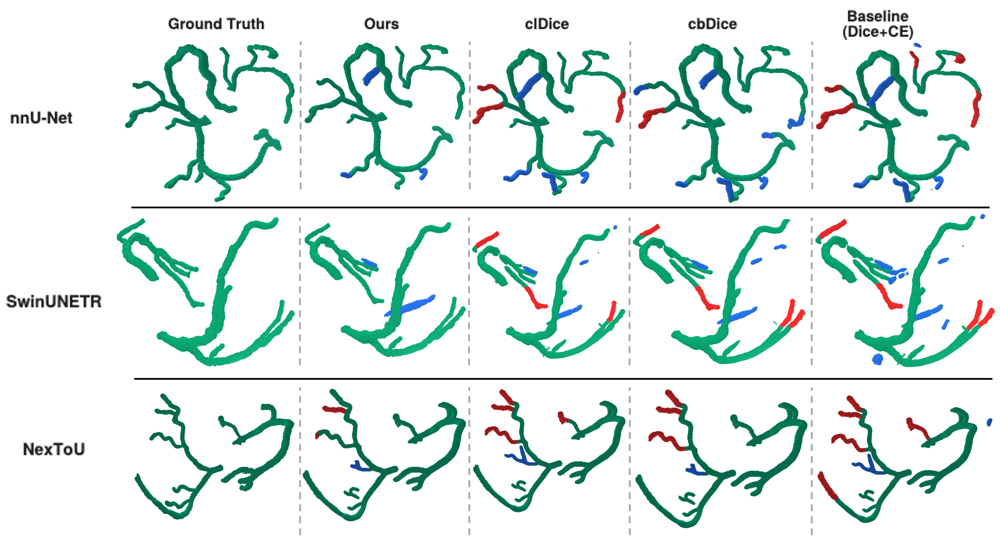

# Beyond Volume Overlap: Surface Matching for Topology-Aware Coronary Artery Segmentation

[](https://github.com/BCV-Uniandes/Coronary-Surface-Matching)
[](https://github.com/BCV-Uniandes/Coronary-Surface-Matching)
[](https://github.com/BCV-Uniandes/Coronary-Surface-Matching/blob/main/LICENSE)
[](https://github.com/MIC-DKFZ/nnUNet)

| Rafael Velasquez, Esther Puyol-Antón, and Pablo Arbeláez |
| :------------------------------------------------------- |

*Universidad de los Andes, Bogotá, Colombia* · *School of Biomedical Engineering & Imaging Sciences, King's College London, London, UK*

Accepted at the **STACOM Workshop, MICCAI 2026**.

---

**Beyond Volume Overlap** rethinks how coronary artery segmentation is measured and optimized. Instead of the volume overlap Dice coefficient, which is dominated by a handful of thick proximal segments and stays nearly blind to the thin distal branches that matter clinically, we operate directly on the vessel surface. We contribute an **asymmetric surface metric** that decouples missed vessel from spurious vessel, and a **differentiable surface loss** that recovers missing distal structure while suppressing hallucinated mass. The framework is model agnostic and is validated on two public CCTA benchmarks (ImageCAS, ASOCA) across three backbones (nnU-Net, SwinUNETR, NexToU).

---

## Overview

<p align="center">
  
</p>

CCTA volumes pass through standard nnU-Net preprocessing (resampling, normalization, patch and batch configuration). During fine-tuning, the segmentation backbone is supervised by the usual Dice plus cross-entropy objective together with our surface loss, which adds a removal term (drives spurious probability down) and a creation term (grows missed branches). The total objective is

$$\mathcal{L} = \mathcal{L}_{Dice+CE} + \lambda(t)\,\widetilde{\mathcal{L}}_c$$

with a linear warm-up on the surface term so it never destabilizes early training.

---

## Motivation: What Dice Cannot See

The Dice coefficient fails on thin, tubular anatomy for three intrinsic reasons:

1. **Volume bias.** Dice is dominated by thick proximal segments, so the loss is effectively blind to thin distal branches that contribute negligible volume.
2. **Topological blindness.** A single broken branch or a hallucinated bridge changes only a handful of voxels, so Dice barely moves even as the clinical anatomy is corrupted.
3. **Error conflation.** Dice collapses false positives (spurious branches) and false negatives (missed vessels) into one symmetric number, so it cannot tell whether a model hallucinates or omits.

Applying our surface metric to a strong Dice+CE baseline (mean Dice 80.99) exposes the gap that the scalar Dice hides: the error is directional, and it concentrates almost entirely in the distal tree.

| Vessel calibre | Missed (FN) rate | Volume share |
| :------------------------------------ | :--------------: | :----------: |
| Thin distal (r < 0.8 mm) | 39.5% | 1.2% |
| Medium (0.8 ≤ r < 1.5 mm) | 12.5% | 24.0% |
| Thick proximal (r ≥ 1.5 mm) | 4.5% | 74.9% |

Thin distal branches are missed nearly an order of magnitude more often than thick ones, yet they carry barely 1% of the volume that drives Dice.

---

## Key Contributions

### Asymmetric Surface Metric

A bipartite matching framework between predicted and reference surface points, extracted via Marching Cubes. A predicted point matches a reference point only when it falls inside the reference tube, using a **per-point tolerance equal to the true local vessel radius** read from the reference distance transform (no tuned hyperparameter, no centerline annotation). Unmatched reference points are false negatives (missed branches), unmatched predicted points are false positives (spurious branches). The metric reports **decoupled precision, recall, and F1** over the full, un-subsampled surface, so it isolates the hallucinate-versus-omit asymmetry that symmetric Dice cannot.

### Differentiable Surface Loss

A two-term objective that mirrors the two error modes the metric decouples:

- **Removal term** ($\mathcal{L}_{rem}$): penalizes probability placed far from the vessel, weighted by an exterior distance field, so spurious mass is pushed down.
- **Creation term** ($\mathcal{L}_{cre}$): penalizes low probability on the reference surface, weighted by the distance to the *current* prediction. Because that field is recomputed each step, an entirely-missed branch keeps a large, growing gradient until it is covered.

Both terms act on surface points, so a thin distal branch receives the same gradient magnitude as a thick proximal trunk. This is the property that lets the loss recover distal vessel that volume-weighted objectives ignore.

---

## Results

### ImageCAS

Dice, clDice, and F1: higher is better. β0-err, FP (spurious), and FN (missed): lower is better. Dice, clDice, and F1 are on a 0 to 100 scale. Best per backbone group in **bold**.

| Backbone | Loss | Dice ↑ | clDice ↑ | β0-err ↓ | FP ↓ | FN ↓ | F1 ↑ |
| :--------- | :--------- | :--------: | :--------: | :------: | :---------: | :---------: | :--------: |
| **nnU-Net** | Dice+CE | 80.99 | 86.23 | 6.14 | 14,972 | 22,124 | 79.50 |
| | clDice | 81.64 | 86.78 | 5.14 | 14,180 | 21,542 | 80.20 |
| | cbDice | 81.92 | 86.99 | 4.53 | 13,835 | 21,089 | 80.50 |
| | **Ours** | **82.05** | **87.12** | **4.05** | **13,215** | **15,798** | **82.60** |
| **SwinUNETR** | Dice+CE | 79.23 | 83.28 | 20.44 | 19,717 | 24,215 | 77.30 |
| | clDice | 80.33 | 85.14 | 14.42 | 19,354 | 23,985 | 78.50 |
| | cbDice | 80.57 | 85.94 | 13.12 | 19,068 | 23,657 | 78.70 |
| | **Ours** | **80.93** | **86.23** | **11.25** | **17,540** | **19,853** | **79.70** |
| **NexToU** | Dice+CE | 80.80 | 86.47 | 6.39 | 14,818 | 20,215 | 79.60 |
| | clDice | 81.50 | 86.70 | 5.29 | 14,385 | 19,231 | 79.90 |
| | cbDice | 81.63 | 86.94 | 5.02 | 14,022 | 18,963 | 80.10 |
| | **Ours** | **81.94** | **87.52** | **4.35** | **13,098** | **16,224** | **82.10** |

On nnU-Net the surface loss barely moves Dice (80.99 to 82.05) but lifts surface F1 from 79.50 to 82.60, driven by a 29% drop in false negatives (22,124 to 15,798) with false positives also falling. The gain is significant on all three backbones (paired Wilcoxon, p < 0.05, Holm-corrected). Against cbDice, the strongest distance-transform baseline, our loss leaves over 5,000 fewer missed surface points.

### ASOCA (second-dataset replication)

Strongest baseline versus our method per backbone. With n = 8 test cases these are point estimates, reported as corroboration of the ImageCAS trend rather than strong external validation.

| Backbone | Method | Dice ↑ | clDice ↑ | β0-err ↓ | FP ↓ | FN ↓ | F1 ↑ |
| :--------- | :------------ | :-------: | :-------: | :------: | :-----: | :-----: | :-------: |
| **nnU-Net** | Best baseline | 88.14 | 87.81 | 8.75 | 4,270 | 5,157 | 85.40 |
| | **Ours** | **88.54** | **87.98** | **7.22** | **3,985** | **4,520** | **87.10** |
| **SwinUNETR** | Best baseline | 85.11 | 84.77 | 15.62 | 4,663 | 8,288 | 81.90 |
| | **Ours** | **85.74** | **85.12** | **13.25** | **4,283** | **7,235** | **82.50** |
| **NexToU** | Best baseline | 86.89 | 86.27 | 7.88 | 4,559 | 5,639 | 84.30 |
| | **Ours** | **87.25** | **86.90** | **6.54** | **4,231** | **4,725** | **84.90** |

### Qualitative Comparison

<p align="center">
  
</p>

Predictions colored against the reference: green is correctly segmented (TP), red is missed reference vessel (FN), blue is spurious predicted vessel (FP). Across all three backbones the overlap-trained baselines leave many thin distal branches unsegmented (large red regions). Our loss recovers a substantial fraction of them, restoring tree continuity, while blue over-segmentation stays rare.

---

## 📦 Getting Started

This repository provides the surface loss, trainers, and surface metric built on top of [nnU-Net v2](https://github.com/MIC-DKFZ/nnUNet). It is not a standalone package: the training code plugs into an nnU-Net v2 installation, while the metric and evaluation scripts run on their own.

**1. Clone the repository.**

```bash
git clone https://github.com/BCV-Uniandes/Coronary-Surface-Matching.git
cd Coronary-Surface-Matching
```

**2. Create the environment and install nnU-Net v2.**

```bash
conda create -n coronary-surface python=3.10
conda activate coronary-surface
pip install nnunetv2
pip install monai            # required for the SwinUNETR backbone
```

**3. Register the trainers and losses.** Copy the training files into your nnU-Net installation, where `$NNUNET` is the root of your nnU-Net v2 source:

```bash
# loss functions -> nnunetv2/training/loss/
cp surface_loss/*.py  $NNUNET/nnunetv2/training/loss/

# trainers -> nnunetv2/training/nnUNetTrainer/
cp trainers/*.py      $NNUNET/nnunetv2/training/nnUNetTrainer/
```

The scripts in `metric/` and `evaluation/` run standalone and only need the predictions and reference masks as input.

---

## 🗂️ Datasets

We use two public CCTA benchmarks, both fully de-identified by their providers.

| Dataset | Cases | Split |
| :------------------------------------------------------------------ | :---------------------------- | :------------------------------------------------ |
| [ImageCAS](https://github.com/XiaoweiXu/ImageCAS-A-Large-Scale-Dataset-and-Benchmark-for-Coronary-Artery-Segmentation-based-on-CT) | 1000 CCTA volumes | 200 held out for test, 5-fold CV on the other 800 |
| [ASOCA](https://asoca.grand-challenge.org/) | 40 cases (20 normal, 20 diseased) | 8 held out for test, 5-fold CV on the other 32, stratified by normal/diseased |

After downloading, format each dataset following the nnU-Net raw data convention and run planning and preprocessing:

```bash
nnUNetv2_plan_and_preprocess -d DATASET_ID --verify_dataset_integrity
```

---

## 🏋️ Training and Fine-tuning

For each backbone we first train a Dice+CE baseline for 1000 epochs, then fine-tune from those weights for a further 150 epochs at learning rate 1e-3 with the surface loss.

**1. Train the Dice+CE baseline.**

```bash
nnUNetv2_train DATASET_ID 3d_fullres FOLD -tr nnUNetTrainer
```

**2. Fine-tune with the surface loss.**

```bash
nnUNetv2_train DATASET_ID 3d_fullres FOLD \
  -tr nnUNetTrainerSurfaceLoss \
  -pretrained_weights path/to/baseline/checkpoint_final.pth
```

Default surface-loss configuration:

| Hyperparameter | Symbol | Value |
| :---------------------------- | :--------------------------: | :-----: |
| Warm-up length | $T_w$ | 30 epochs |
| Target fraction of base loss | $\lambda_{max}$ | 0.20 |
| Removal / creation weights | $\lambda_{rem}, \lambda_{cre}$ | 1, 1 |
| Distance clip | $\delta$ | 20 mm |

> Note: adjust the trainer name, dataset IDs, and checkpoint paths to match your local nnU-Net setup.

---

## 📊 Evaluation

We report three metric families: Dice for volume overlap; clDice and β0 error for topology; and precision, recall, and F1 from our surface metric. Each fine-tuned loss is tested against the Dice+CE baseline with a paired Wilcoxon signed-rank test and Holm correction.

```bash
python evaluation/surface_metric.py \
  --pred path/to/predictions \
  --gt path/to/ground_truth \
  --output results/surface_scores.csv
```

The surface metric reads the per-point radius tolerance directly from each reference mask, so no tuning is required and the same tolerance is applied identically to every method compared.

---

## ✍️ Citation

If you find this work useful, please cite:

```bibtex
@inproceedings{velasquez2026surface,
  title     = {Beyond Volume Overlap: Surface Matching for Topology-Aware Coronary Artery Segmentation},
  author    = {Velasquez, Rafael and Puyol-Ant{\'o}n, Esther and Arbel{\'a}ez, Pablo},
  booktitle = {Statistical Atlases and Computational Models of the Heart (STACOM), MICCAI Workshop},
  year      = {2026},
  publisher = {Springer}
}
```

---

## 🙏 Acknowledgments

This work was supported by Azure sponsorship credits granted by Microsoft's AI for Good Research Lab. We gratefully acknowledge the **RISE-MICCAI Paper-Lead Mentorship Program** for fostering this collaboration, and in particular the mentorship of Rafael Velasquez by Esther Puyol-Antón. We also thank the **RISE-MICCAI Travel Grant** for supporting the presentation of this work at MICCAI 2026.

---

## 📄 License

This repository is released under the MIT License. See [`LICENSE`](https://github.com/BCV-Uniandes/Coronary-Surface-Matching/blob/main/LICENSE) for details.
